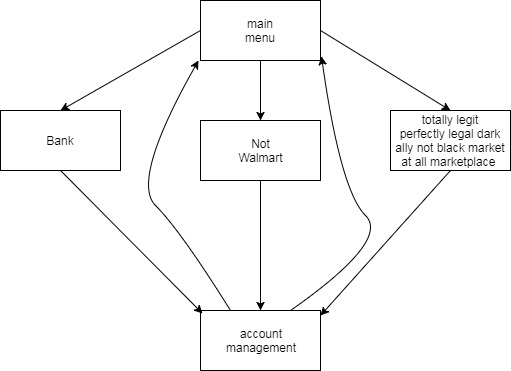

# Final

This is a Sim City ripoff. The main function asks you where you want to go: the bank, the store, or a black market shop.

1) The bank opens up asking you if you already have an account made up. If you don't, then you'd hit no. It would then ask if you wanted to create an account, then it'll bring up a prompt for you to create a username and password. After that, you'd have to enter them again to access the main part of the bank. From here, you could either put money in, take money out, or leave the bank.

2) The store starts by asking where you wanted to go in the store: the deli, frozen aisles, or soda aisle.

	a) The deli has 3 things to offer: ham, turkey, and salami. You choose what you'd like to buy 	and how many pounds of that meat you'd like.

	b) The frozen aisles have 3 things to offer: fries, pizza, and ice cream. Each choice have 	different types you can choose from. There are curly fries and steak fries. There are cheese, 	pepperoni, and sausage pizzas to choose from. There are 3 choices of ice cream to choose from: 	vanilla, chocolate, and cookies n' cream. You can choose which item you'd like, which type of 	that item, and how many you'd like.

	c) The soda aisle have 3 sodas to choose from: Pepsi, Mountain Dew, and Sprite. Once you 	choose which soda you'd like, you choose if you'd like cans or bottles. You can have a 12 pack 	of cans or a 24 pack of cans. There are also 6 packs of bottles and 2 liters to choose from. 	You choose which package and how many you'd like.

Once you have chosen everything you'd like, you can go to check out, and the prices everything you've picked up is calculated and the total is taken out of your bank account.

3) The black market is a place to get rare and exotic items you shouldn't have and probably shouldn't exist.
It has 6 of 20 items at any point in time. It randomly selects 6 items out of a list to sell and everytime you go back to 
the black market, it may have something diffrent every time.

https://youtu.be/xo4DOzA37gA
